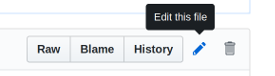
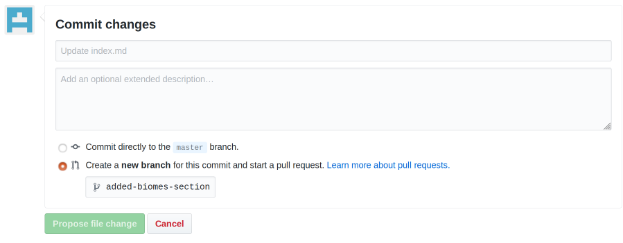

# ISIMIP3a webprotocol testbed

This code is derived from the [minimal theme](http://pages-themes.github.io/minimal). For technical details see there.

We plan a webprotocol that features:

* a transparent history of its evolution
* in-browser filtering for shortened versions relevant to specific sectors
* programmed tables that are consistent by design  
* easy editing via the browser or offline

Here is one proposition of such webprotocol, using github's built-in rendering feature. You can edit in markdown in several ways. Once online on github, your edits will be rendered and become visible via [github.io](https://matthiasmengel.github.io/isimip3a-protocol-mockup/).

## Quickest start

Open index.md online and use the edit button to edit online in the browser. 

Once you are done, go to the bottom of the page and commit your changes.
Create a pull request and describe why you did that change, so others can judge it.

## Use offline (simple)

* `git clone git@github.com:matthiasmengel/isimip3a-protocol-mockup.git`

* create a new branch `topic-of-my-changes` via `git branch` 

* Edit the `index.md` file in your favorite markdown editor.

* Push to github and file a pull request so others can review.

## Use offline (pro)

### Installing on Ubuntu (added by Matthias M., tested for 18.04)

* `sudo apt install ruby ruby-dev zlib1g-dev`
* `export GEM_HOME=$HOME/gems
   export PATH=$HOME/gems/bin:$PATH`
   (add to your .bashrc for next time)
* `sudo gem update --system`
* Run `script/bootstrap` to install the necessary dependencies
* `bundle exec jekyll serve --livereload` to serve the website.
* Visit [`localhost:4000`](http://localhost:4000) in your browser to preview the theme

* start editing. The base html file is in [_layouts/default.html](_layouts/default.html).